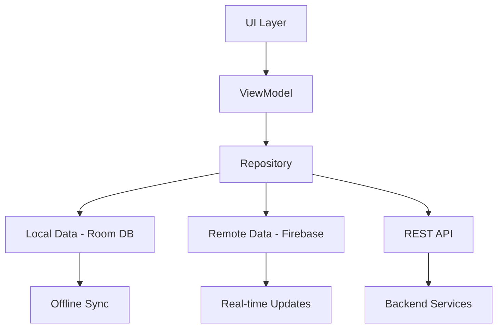

# TholaGig - Find Gigs. Earn Money. Build Your Future.


*Connecting Talent with Opportunity in South Africa - Formalizing the Informal Economy*

##  App Overview

**Github Repository**: https://github.com/peace05-star/Tholagig.git (Personal)

**School Repository**: https://github.com/IIEMSA/2025-nov-opsc6312-poe-part3-peace05-star.git (School)

**Demo Video**: 

---

##  Purpose & Vision

### The Problem We Solve
South Africa has one of the largest informal labour markets in the world, with millions relying on "piece jobs" or "skropes" - temporary work that often lacks structure, visibility, and dignity. While global platforms like Fiverr exist, they don't address the unique needs of South African workers.


### Our Mission
TholaGig ("Thola" means "find" in isiZulu) formalizes the informal economy by providing a comprehensive freelance marketplace designed specifically for South African realities.

### Growth Vision
- **Now**: Empowering disadvantaged workers with tools to track and grow their work
- **Next**: Expanding to serve higher-skilled professionals
- **Future**: Becoming South Africa's trusted freelancing ecosystem

---

##  Technical Architecture

### System Design Overview


### MVVM Pattern Implementation
```
View (Activity/Fragment) → ViewModel → Repository → Data Sources
                                      ↓
                Local DB + Firebase + REST API Services
```

### Package Structure
```
app/
├──  auth/                    # Authentication & SSO
├── dashboards/             # Client & Freelancer Dashboards
├──  jobs/                   # Job Management
├──  messaging/              # Real-time Chat
├──  profiles/               # User Profiles
├──  network/               # API & Firebase Services
├──  data/                  # Local Storage & Repositories
├──  notifications/         # Push Notifications
├──  language/             # Multi-language Support
└──  sync/                 # Offline Synchronization
```

---

##  Technology Stack

### Core Technologies
| Category | Technologies |
|----------|--------------|
| **Mobile Framework** | Android Native (Kotlin) |
| **Architecture** | MVVM, Repository Pattern |
| **Local Database** | Room DB with SQLite |
| **Backend Services** | Firebase Auth, Firestore, Cloud Messaging |
| **Networking** | Retrofit 2, Gson Converter |
| **UI Components** | Material Design 3, Jetpack Compose |

### Key Dependencies
```kotlin
// Architecture Components
implementation("androidx.lifecycle:lifecycle-viewmodel-ktx:2.7.0")
implementation("androidx.room:room-runtime:2.6.0")

// Firebase
implementation(platform("com.google.firebase:firebase-bom:32.7.0"))
implementation("com.google.firebase:firebase-auth-ktx")
implementation("com.google.firebase:firebase-messaging-ktx")

// Networking
implementation("com.squareup.retrofit2:retrofit:2.9.0")
implementation("com.squareup.retrofit2:converter-gson:2.9.0")

// SSO Integration
implementation("com.google.android.gms:play-services-auth:20.7.0")
```

---

##  Innovative Features Implementation

### 1. Single Sign-On (SSO) Integration


**Implementation Details:**
- **Multi-provider SSO** support (Google, extensible to others)
- **Seamless authentication** with Firebase backend
- **Secure token management** and automatic session handling
- **Profile synchronization** across devices

**Key Components:**
- `SSOService.kt` - Central SSO management
- Enhanced `LoginActivity.kt` with SSO options
- Secure credential handling with OAuth 2.0

### 2. Offline-First with Smart Synchronization


**Capabilities:**
-  **Browse gigs** without internet connection
-  **Create job posts** that queue for later submission
-  **Manage profiles** and portfolios offline
-  **Chat message queuing** with delivery status
-  **Automatic conflict resolution** when back online

**Technical Implementation:**
- **Room DB** with entities for users, gigs, messages
- **Repository pattern** with dual data sources (local/remote)
- **WorkManager** for background synchronization
- **Conflict detection** and resolution strategies

### 3. Real-time Push Notification System


**Notification Types:**
-  **New gig matches** and recommendations
-  **Instant messaging** notifications
-  **Project updates** and milestones
-  **System announcements** and updates

**Features:**
- **Priority-based** delivery system
- **Deep linking** to relevant app sections
- **Battery-efficient** background processing
- **Customizable** notification preferences

### 4. Multi-language Support


**Supported Languages:**
- **🇬🇧 English** - Primary language
- **🇿🇦 isiZulu** - South African official language
- **🇿🇦 Afrikaans** - Widely spoken SA language

**Implementation:**
- Android resource qualifiers for different locales
- Runtime language switching without app restart
- Cultural context-aware translations
- RTL (Right-to-Left) layout support

---

##  GitHub & Development Workflow

### Repository Structure
```
Tholagig/
├──  app/                   # Main application module
├──  gradle/               # Build configuration
├──  build.gradle.kts      # Project build configuration
├──  settings.gradle.kts   # Project settings
├──  .github/              # GitHub Actions workflows
└──  README.md            # Project documentation
```

### GitHub Actions CI/CD Pipeline

```yaml
name: Android CI

on:
  push:
    branches: [ main, master ]
  pull_request:
    branches: [ main, master ]

jobs:
  build:
    runs-on: ubuntu-latest
    steps:
    - uses: actions/checkout@v3
    - name: Set up JDK 11
      uses: actions/setup-java@v3
      with:
        java-version: '11'
        distribution: 'temurin'
        
    - name: Build with Gradle
      run: ./gradlew build
      
    - name: Run tests
      run: ./gradlew test
```

### Branch Strategy
- `main` - Production-ready code
- `develop` - Development integration
- `feature/*` - New features
- `hotfix/*` - Critical bug fixes
- `release/*` - Release preparation

### Development Process
1. **Fork & Clone** the repository
2. **Create feature branch**: `git checkout -b feature/innovative-feature`
3. **Implement changes** with comprehensive testing
4. **Commit using conventional messages**:
   ```bash
   git commit -m "feat: add SSO authentication service"
   git commit -m "fix: resolve offline sync conflicts"
   ```
5. **Push and create Pull Request** with detailed description

---

##  Release Notes

###  Version 2.0 - "Innovation Release"
*Latest Major Update - Integrating Advanced Features*

#### New Features Added:
1. **🔐 Single Sign-On (SSO) Integration**
   - Google Sign-In implementation
   - Secure Firebase authentication backend
   - Automatic user profile synchronization
   - Extensible architecture for additional providers

2. **Offline-First Architecture**
   - Room Database implementation for local storage
   - Background synchronization with WorkManager
   - Conflict resolution for data consistency
   - Queue system for offline actions

3. **Real-time Push Notifications**
   - Firebase Cloud Messaging integration
   - Custom notification types and priorities
   - In-app notification center
   - Battery-efficient delivery system

4. **Multi-language Support**
   - isiZulu language implementation
   - Afrikaans language support
   - Runtime language switching
   - Cultural context-aware translations

#### Technical Improvements:
- **Enhanced Security**: OAuth 2.0 implementation
- **Performance**: Optimized data synchronization
- **User Experience**: Seamless online/offline transitions
- **Accessibility**: RTL layout support and improved navigation

#### Bug Fixes:
- Resolved authentication token expiration issues
- Fixed offline data synchronization conflicts
- Improved notification delivery reliability
- Enhanced error handling and user feedback

---

##  Getting Started

### Prerequisites
- Android Studio Arctic Fox or later
- JDK 11 or higher
- Firebase project configuration
- Google Cloud Console setup for SSO

### Installation Steps
1. **Clone the repository**
   ```bash
   git clone https://github.com/peace05-star/Tholagig.git
   cd Tholagig
   ```

2. **Firebase Configuration**
   - Create Firebase project at [console.firebase.google.com](https://console.firebase.google.com)
   - Add Android app with your package name
   - Download `google-services.json` to `app/` directory

3. **SSO Setup**
   - Configure OAuth credentials in Google Cloud Console
   - Add SHA-1 fingerprint to Firebase project

4. **Build and Run**
   ```bash
   ./gradlew build
   ```

### Configuration
Update `app/src/main/res/values/strings.xml`:
```xml
<string name="default_web_client_id">YOUR_GOOGLE_WEB_CLIENT_ID</string>
```

---

##  Development Team

| Role | Team Member | Focus Areas |
|------|-------------|-------------|
| **Project Lead & Backend** | Ndumiso Magwanya | System Architecture, API Design |
| **UI/UX Design & Frontend** | Peace Salomy Phiri | User Experience, Interface Design |
| **API Development** | Sinazo Happy Mgidi | REST API, Integration |
| **Mobile Architecture** | Sindiswa Nomakhalwa Madliwa | Android Development, Database |

---

##  Project Status

### Current Version: 2.0 - Innovation Release
** Completed Features:**
- [x] Firebase Authentication with SSO
- [x] Offline-first architecture with Room DB
- [x] Real-time push notifications
- [x] Multi-language support (English + isiZulu)
- [x] Job posting and browsing system
- [x] Messaging and communication platform

** In Development:**
- [ ] Advanced payment integration
- [ ] Gamification system for user engagement
- [ ] Advanced analytics and insights
- [ ] QR code networking features

** Future Roadmap:**
- Additional SSO providers (Facebook, Apple)
- Advanced offline conflict resolution
- Voice-based navigation
- More South African languages
- Advanced search and recommendation engine

---


## Support & Community

- **  Bug Reports**: [GitHub Issues](https://github.com/peace05-star/Tholagig/issues)
- ** Community Forum**: Discord Channel (Coming Soon)
- ** Documentation**: [Wiki Pages](https://github.com/peace05-star/Tholagig/wiki)

---


